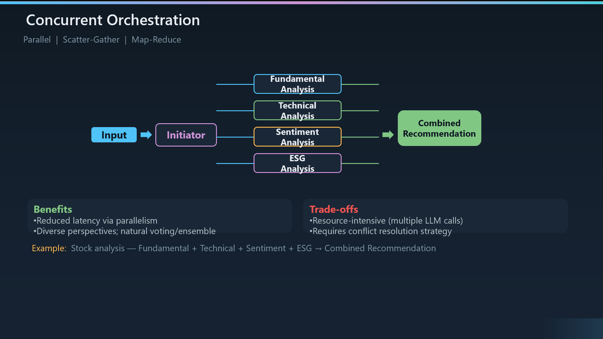

# Concurrent Orchestration

``What it is``: Concurrent orchestration — also called Parallel, Scatter-Gather, or Map-Reduce — runs multiple agents simultaneously on the same task. An Initiator dispatches the work, each agent provides independent analysis from its own specialization, and the results are aggregated into a single output.

``Key structural difference from Sequential``: Where Sequential is a pipeline — one agent at a time, each building on the last — Concurrent fans out to all agents at once. The agents don't see each other's work. They operate independently and in isolation, which is both the strength and the limitation.

``Walking through the example``: In the stock analysis scenario, four specialized agents run in parallel — Fundamental Analysis looks at financials and valuation, Technical Analysis examines price patterns and indicators, Sentiment Analysis scans news and social media, and ESG Analysis evaluates environmental and governance factors. None of them need input from the others, so they run simultaneously and their outputs are merged into a Combined Recommendation.

``When to use it``: This pattern shines when tasks are naturally parallelizable, when you want multi-perspective analysis on the same input, for voting or ensemble decisions where diverse viewpoints improve accuracy, and in time-sensitive scenarios where you can't afford to serialize agent calls.

``When to avoid it``: If agents need cumulative context — where Agent 2 needs Agent 1's output to do its job — you need Sequential, not Concurrent. Also avoid if you don't have a clear conflict resolution strategy for when agents disagree, or if resource constraints make multiple simultaneous LLM calls prohibitive.

``Benefits — speed and diversity``: The biggest win is reduced latency — four agents running in parallel take roughly the same wall-clock time as one. You also get diverse perspectives, which is a natural fit for ensemble-style decisions. If three out of four agents agree, you have high confidence in the result.

``Trade-offs to acknowledge``: It's resource-intensive — you're making multiple LLM calls simultaneously, which means higher token costs and compute load. You need a deliberate conflict resolution strategy for when agents return contradictory results. And there's no context sharing between concurrent agents — they can't build on each other's reasoning.

``Implementation options``: Semantic Kernel provides ConcurrentOrchestration as a built-in class. In LangGraph, you use the Send() API for fan-out. AutoGen supports this partially, and the new Agent Framework's Workflow API handles it with fan-out/fan-in edges and barrier synchronization. In Azure Functions Durable Agents, this maps to Task.WhenAll() for parallel execution with automatic checkpointing.

``Contrast with the previous slide``: Sequential is about progressive refinement — each stage enriches the artifact. Concurrent is about independent analysis — each agent contributes a separate perspective. The decision between them is simple: do the agents need each other's output? If yes, Sequential. If no, Concurrent.

