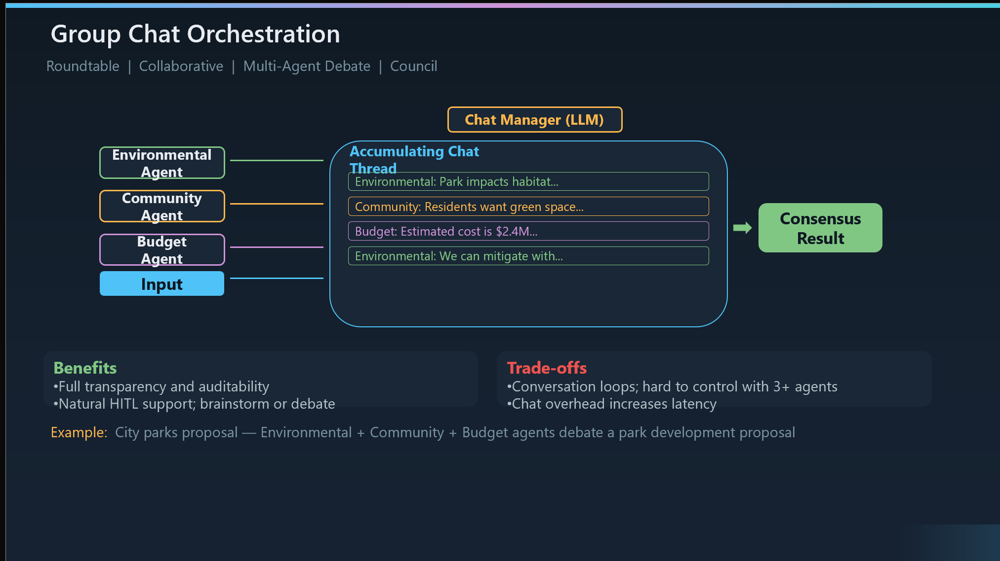

# Group Chat Orchestration

``What it is``: Group Chat orchestration has multiple agents collaborating through a shared conversation thread — like a roundtable discussion. A Chat Manager (itself an LLM) coordinates who speaks when, and all agents contribute to a single accumulating thread. Unlike the previous patterns, agents here can see and respond to each other's reasoning.

``Also known as``: Roundtable, Collaborative, Multi-Agent Debate, or Council. The metaphor is a room full of experts having a structured discussion, with a moderator keeping the conversation on track.

``How the diagram works``: On the left, you see the three participating agents — Environmental, Community, and Budget. Each contributes messages into the shared Accumulating Chat Thread on the right. The Chat Manager at the top is an LLM that decides turn order — which agent speaks next based on the current state of the conversation. The thread grows as agents respond to each other, eventually converging on a Consensus Result.

``Walking through the example``: The city parks proposal is a perfect illustration. The Environmental Agent raises habitat concerns, the Community Agent advocates for green space, and the Budget Agent flags the $2.4M cost estimate. Then Environmental responds with mitigation strategies — it's reacting to the concerns raised by the other agents. This back-and-forth is what makes Group Chat unique — agents refine their positions based on the ongoing debate.

``The Maker-Checker sub-pattern``: A powerful variant worth calling out is the Maker-Checker loop — one agent creates output, another evaluates it, and they iterate until the checker approves. This is essentially code review, editorial review, or compliance validation as a two-agent group chat. It's one of the most practical applications of this pattern.

``When to use it``: Creative brainstorming where diverse perspectives need to interact, consensus-building where stakeholders must agree, iterative refinement like the Maker-Checker loop, quality assurance and compliance validation, and any scenario where agents need to respond to and build on each other's reasoning.

``When to avoid it``: If a linear pipeline is sufficient — don't add the overhead of a conversation when simple chaining works. Avoid for real-time latency requirements since the multi-turn conversation adds significant time. And critically, Microsoft's guidance warns that control becomes difficult with more than about three agents — the conversation can become unfocused.

``Benefits to emphasize``: Full transparency and auditability — every agent's reasoning is captured in the thread, so you can trace exactly how the group reached its conclusion. Natural support for human-in-the-loop — a human participant can join the conversation just like any other agent. And it's flexible — the same pattern supports brainstorming, formal debate, and structured review.

``Trade-offs to call out``: Conversation loops are the biggest risk — agents can get stuck in circular debates. With more than three agents, it becomes hard to keep the discussion productive — the Chat Manager needs to be capable enough to moderate effectively. And every turn in the conversation is an LLM call, so chat overhead adds up in both latency and token cost.

``Implementation options``: Semantic Kernel provides GroupChatOrchestration. AutoGen offers multiple flavors — SelectorGroupChat where an LLM picks the next speaker, and RoundRobinGroupChat for fixed turn order. The Agent Framework supports this through the GroupChatBuilder. LangGraph can implement it via shared state graphs. The Chat Manager is typically the most important design decision — it controls conversation quality.

``How it contrasts with the other patterns``: Sequential chains agents but they don't see each other's work. Concurrent runs agents in parallel but they're isolated. Handoff transfers between agents one at a time. Group Chat is the only pattern where agents actively interact, debate, and refine each other's contributions. That makes it the most powerful for consensus-driven problems — but also the most expensive and hardest to control.

