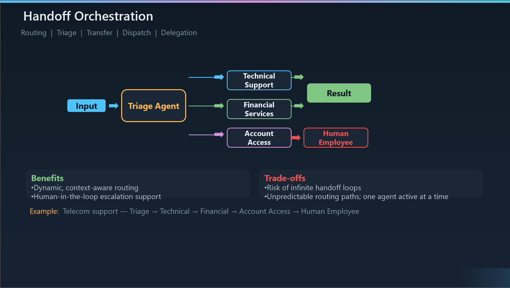

# Handoff Orchestration

``What it is``: Handoff orchestration enables dynamic delegation between specialized agents. A Triage Agent receives the input, assesses the task, and decides which specialist should handle it. Each specialist can also decide to transfer to another agent if the problem shifts domain — or escalate to a human. Only one agent is active at any given time.

``Also known as``: Routing, Triage, Transfer, Dispatch, or Delegation. If you've built a customer support IVR or a help desk ticketing system, this is the AI-native version of that same pattern.

``The key differentiator — dynamic routing``: Unlike Sequential (where the path is predetermined) or Concurrent (where everyone runs at once), Handoff lets the right specialist emerge during processing. The Triage Agent doesn't need to know the full solution path upfront — it just needs to identify the right first specialist. From there, each agent can re-route as the problem unfolds.

``Walking through the example``: In the telecom support scenario, a customer calls in and the Triage Agent classifies the issue. A billing dispute goes to Financial Services. A connectivity problem goes to Technical Support. If Technical Support discovers the issue is actually a locked account, it hands off to Account Access. And if Account Access hits a policy exception it can't resolve, it escalates to a Human Employee. The routing path is discovered at runtime, not designed upfront.

``Human-in-the-loop is a natural fit``: Notice the Human Employee node on the diagram — Handoff is the pattern that most naturally supports escalation to real people. This makes it ideal for enterprise scenarios where certain decisions require human judgment, compliance sign-off, or policy exceptions that AI agents shouldn't handle autonomously.

``When to use it``: Best for situations where the right expertise emerges during processing — you can't know at the start which specialist you'll need. Customer support escalation is the canonical example. Also great for multi-domain problems where only one domain is relevant at a time, and for any workflow that needs a human escalation path.

``When to avoid it``: If you can identify the appropriate agent from the initial input alone, a simple router or even a single agent with tools is simpler. Also avoid when multiple operations should run concurrently — Handoff is strictly one-agent-at-a-time. And critically, watch out for infinite handoff loops where Agent A transfers to Agent B, which transfers back to Agent A.

``Benefits to emphasize``: Dynamic, context-aware routing means the system adapts to the actual problem rather than forcing it through a rigid pipeline. Deep specialization is possible because each agent only handles its domain. And the built-in escalation model means you can mix AI and human agents in the same workflow.

``Trade-offs to call out``: The biggest risk is infinite handoff loops — you need explicit safeguards like max-handoff limits or loop detection. Routing paths are unpredictable, which makes debugging harder than Sequential. And because only one agent is active at a time, you don't get the latency benefits of Concurrent — the total time depends on how many handoffs occur.

``Implementation options``: In AutoGen and the Agent Framework, this maps to the Swarm team type — agents decide when to transfer via tool-based handoff decisions. Semantic Kernel provides HandoffOrchestration as a built-in class. LangGraph implements it through conditional routing edges. The OpenAI Agents SDK also has native handoff support, making it one of the most broadly supported patterns across frameworks.

