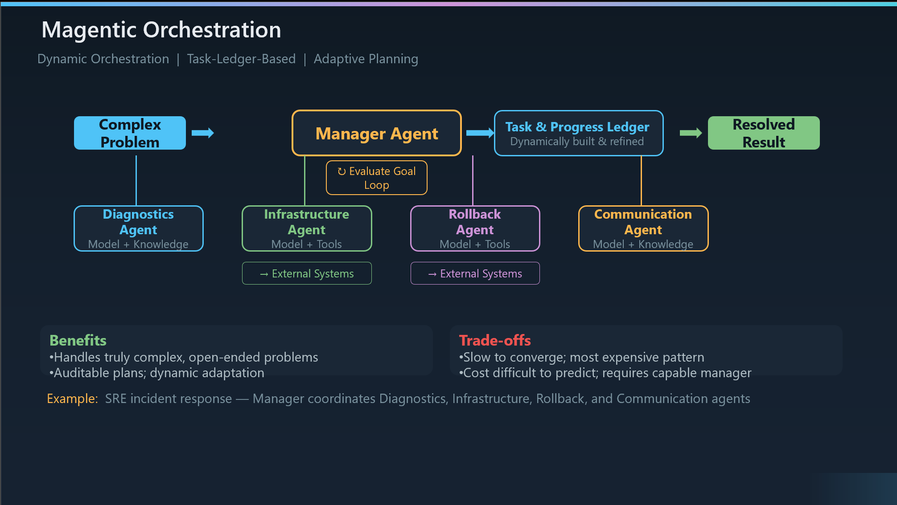

# Magentic Orchestration

``What it is``: Magentic orchestration is designed for open-ended, complex problems where there is no predetermined solution path. A Manager Agent dynamically builds and maintains a Task & Progress Ledger — essentially a living plan — and coordinates specialized agents to execute against it. After each step, the Manager evaluates progress toward the goal and replans if needed. This is the most autonomous and powerful of the five patterns.

``Origin story``: This pattern is inspired by Microsoft Research's Magentic-One system — a generalist multi-agent architecture designed to solve complex tasks that can't be decomposed into a fixed workflow upfront. Microsoft has since codified it as one of the five standard orchestration patterns in their Azure Architecture Center guidance.

``The Task & Progress Ledger is the key concept``: Unlike every other pattern, Magentic doesn't have a fixed execution plan. The Ledger is a dynamically built document that tracks what needs to be done, what's been accomplished, what failed, and what to try next. The Manager Agent creates the initial plan, but it continuously refines it as agents report back results. This is what makes it adaptive — the plan evolves based on what's actually happening.

``The Evaluate Goal Loop``: After each agent completes its work, the Manager reassesses — are we closer to the goal? Did the agent's output change our understanding of the problem? Should we replan? This loop is what separates Magentic from a simple dispatch pattern. It's genuinely reasoning about progress, not just routing tasks.

``Walking through the example``: In the SRE incident response scenario, an alert fires and the Manager Agent creates an initial plan: run diagnostics first. The Diagnostics Agent (Model + Knowledge) analyzes logs and metrics, and reports that a recent deployment caused a memory leak. The Manager replans — now it dispatches the Infrastructure Agent (Model + Tools) to scale resources as a stopgap, then the Rollback Agent (Model + Tools) to revert the deployment. Both of these agents have tools that make actual changes in external systems — this is real action, not just analysis. Meanwhile, the Communication Agent drafts status updates for stakeholders. The Manager monitors all of this and could replan again if the rollback fails.

``Two types of agents — notice the distinction on the diagram``: Some agents have "Model + Knowledge" — they reason and analyze but don't take external actions. Others have "Model + Tools" — they can make changes in external systems like infrastructure scaling or deployment rollback. This distinction matters for security boundaries. Agents with tools carry higher risk and need stricter guardrails.

``When to use it``: Complex, open-ended problems where you genuinely don't know the solution path upfront. Situations requiring a documented audit trail of decisions and replanning. Scenarios that combine research, reasoning, and tool execution. And problems where the initial plan will almost certainly need to be revised — like incident response, complex investigations, or research workflows.

``When to avoid it``: If the solution path is deterministic — use Sequential. If the problem is low complexity — you're paying for a lot of overhead you don't need. For time-sensitive tasks — Magentic is slow because of the planning and replanning overhead. And when the goal is ambiguous — the Manager can stall if it can't clearly assess whether progress is being made.

``Benefits to emphasize``: This is the only pattern that can handle truly complex, open-ended problems. The Ledger makes everything auditable — you have a full record of the plan, its evolution, and every decision the Manager made. Dynamic adaptation means the system can recover from dead ends and unexpected findings. And it combines research, reasoning, and real-world action in a single coordinated workflow.

``Trade-offs to be honest about``: This is the most expensive pattern by a significant margin — the Manager Agent runs a capable LLM on every evaluation loop, plus all the specialist agent calls. Total cost is difficult to predict because you don't know how many iterations the loop will take. It's slow to converge — multiple rounds of plan-execute-evaluate before reaching a conclusion. And the Manager model needs to be highly capable — a weak model here will lead to poor plans and frequent stalls.

``Implementation options``: AutoGen provides MagenticOneGroupChat as a direct implementation. Semantic Kernel offers MagenticOrchestration. The new Agent Framework supports it via MagenticBuilder. LangGraph doesn't have a built-in Magentic implementation — you'd need to build it custom using its graph primitives. This is one of the patterns where the Microsoft ecosystem has a clear advantage.

``Where this fits in the complexity spectrum``: Think of these five patterns as a progression. Sequential for linear workflows, Concurrent for parallel analysis, Handoff for dynamic routing, Group Chat for consensus-building, and Magentic for open-ended problem solving. Each step up adds power but also complexity and cost. Magentic is the top of the stack — use it only when the problem genuinely demands it.

