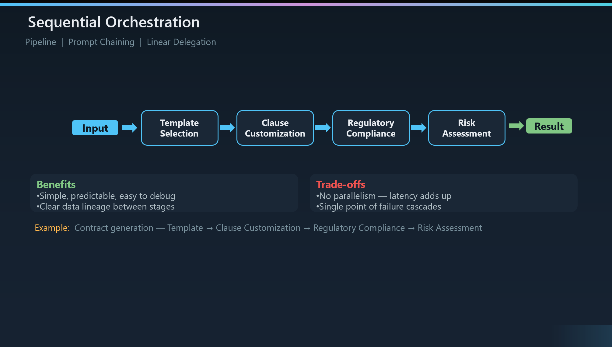

# Sequential Orchestration 

``What it is``: Sequential orchestration chains agents in a predefined, linear order — each agent processes the output from the previous agent, creating a pipeline of specialized transformations. The next agent is deterministically defined, so there's no ambiguity in the flow.

``Also known as``: Pipeline, Prompt Chaining, or Linear Delegation — your audience may have encountered it under different names depending on the framework they've used.
When to use it: This pattern is ideal for multistage processes with clear linear dependencies — think progressive refinement workflows where output is drafted, reviewed, then polished. If each step depends on the previous one completing, sequential is the right fit.

``When to avoid it``: If stages can run independently (embarrassingly parallel), you're adding unnecessary latency by serializing them. Also avoid if the workflow needs backtracking or dynamic routing — sequential has no built-in mechanism for that.
Walking through the example: The contract generation pipeline illustrates this well — Template Selection picks the right starting document, Clause Customization tailors it to the deal, Regulatory Compliance checks legal requirements, and Risk Assessment flags exposure. Each stage enriches the artifact from the previous one.

``Benefits`` — simplicity is the key advantage: The flow is simple, predictable, and easy to debug. When something goes wrong, you know exactly which stage failed and what its input was. Data lineage is clear — you can trace every transformation.
Trade-offs to call out: Zero parallelism means latency adds up linearly — a 4-agent pipeline takes 4x a single agent call. A failure in any stage cascades downstream — there's no partial success. And all stages must be known at design time, so it's not adaptable to dynamic requirements.

``Implementation options``: In Semantic Kernel, this maps to SequentialOrchestration. In AutoGen/Agent Framework, you can use RoundRobinGroupChat or GraphFlow with sequential edges. LangGraph implements it simply through graph edges. All three frameworks on Azure AI Foundry support this pattern natively.

This is your "start here" pattern: Microsoft's guidance recommends starting with the lowest complexity that works. Sequential is the simplest multi-agent pattern — if your workflow fits a linear pipeline, don't over-engineer it with handoffs or group chat.
